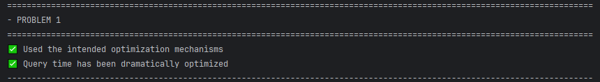
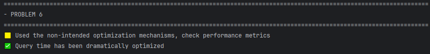
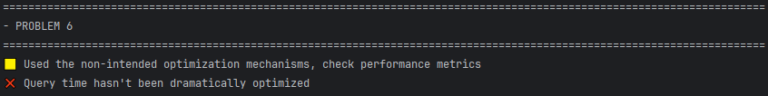

# SQL Fundamentals Recap

This module serves as a test of the knowledge gained during the work on Module 1 (Fundamentals).

---

## 🚀 Getting Started

**Block 1 and 3 uses an embedded PostgreSQL database so no setup needed for these blocks** 

### 1. Setup the Database for Block 2

To spin up the database environment, run the following command in your terminal:

```bash
docker-compose up -d
```

This command starts two containers:

- **PostgreSQL** (database)
- **pgAdmin** (web-based UI for PostgreSQL)

Both are defined in the `docker-compose.yml` file, located in the root of the project (same level as this README).

---

### 2. Connect to the Database

Once the containers are up:

- Open your browser and go to [http://localhost:5050](http://localhost:5050) to access **pgAdmin**, or
- Use any other PostgreSQL client like **psql**, **DBeaver**, or **DataGrip**

This can be useful to additionally analyze tables and queries from problems form the Block 2.

---

### 3. Navigate to Assessment Blocks

Go to:

```
src/test/resources/queries/
```

Inside, you'll find three folders:

- `block_1/`: tasks related to Concurrency (and Locking - TBA 😢)
- `block_2/`: tasks related to Query Optimization
- `block_3/`: tasks related to SQL practice

---


## Block 1: Concurrency (and Locking - TBA 😢)
This block contains 3 problems. Each problem contains a concurrent scenario where you apply correct Isolation level.


#### Goal
Solve all problems by adding a proper Isolation Level for transaction (if needed) and make all tests pass in the `org.codeus.database.fundamentals.recap.SqlQueriesTest.Block_1`.

### Rules
* Do NOT alter files under `setup` folder
* Do NOT alter files under `setup` folder
* Add Isolation Level for transaction 
* Process both files in the problem folder before running tests

### Problems
#### [Problem 1](src%2Ftest%2Fresources%2Fqueries%2Fblock_1%2Fproblem_1)
#### [Problem 2](src%2Ftest%2Fresources%2Fqueries%2Fblock_1%2Fproblem_2)
#### [Problem 3](src%2Ftest%2Fresources%2Fqueries%2Fblock_1%2Fproblem_3)

---

## Block 2: Optimization problems
This block contains 8 problems. Each problem contain a query that you should optimize.

#### Goal
Solve all problems and make all tests pass in the `org.codeus.database.fundamentals.recap.SqlQueriesTest.Block_2`.

#### Rules
* Do NOT alter/insert data in the database
* Do NOT alter or uncomment code in problem files
* Write your solution under `-- WORKING AREA` tag

#### Tips
* Read description of each problem carefully, and analyze what can be done to achieve problems goal;
* Some performance mechanisms may already exist ;
* Problem can have multiple solutions;
* Problem may require removing existing index;
* Use a DB client and `EXPLAIN ANALYZE` mechanism to analyze query before tests execution;
* Most problems have small and big hints. Use them wisely.
  * Small hint - light hint to point the direction of thinking;
  * Big hint - contain almost the full answer to the problem. 

#### General Hints

<details> 
<summary>Hint 1: Index related tasks (click to expand)</summary>
Use SQL below to read all created custom indexes:

<code>SELECT tablename, indexname, indexdef FROM pg_indexes WHERE schemaname = 'public' AND tablename = '<your_table>' ORDER BY tablename, indexname;</code>

</details>
<details> 
<summary>Hint 2: View related tasks (click to expand)</summary>
Use SQL below to read all created custom views:

<code>SELECT viewname, definition
FROM pg_catalog.pg_views
WHERE schemaname NOT IN ('pg_catalog', 'information_schema');</code>
</details>

#### Additional info on test outputs
<details> 
<summary>Correct solution output example(click to expand)</summary>

</details>
<details> 
<summary>Correct solution but not optimal output example(click to expand)</summary>

</details>
<details> 
<summary>Incorrect solution output example(click to expand)</summary>

</details>

### Problems:
#### [Problem 1](src%2Ftest%2Fresources%2Fqueries%2Fblock_2%2Fproblem_1.sql)
<details> 
<summary>Big Hint (click to expand)</summary>
Create a regular index using created_at column.
</details>

#### [Problem 2](src%2Ftest%2Fresources%2Fqueries%2Fblock_2%2Fproblem_2.sql)
<details> 
<summary>Big Hint (click to expand)</summary>
Create a regular view for the main query.
</details>

#### [Problem 3](src%2Ftest%2Fresources%2Fqueries%2Fblock_2%2Fproblem_3.sql)

<details> 
<summary>Big Hint (click to expand)</summary>
Create a Composite index using amount and transaction_date columns.
</details>

#### [Problem 4](src%2Ftest%2Fresources%2Fqueries%2Fblock_2%2Fproblem_4.sql)

<details> 
<summary>Small Hint (click to expand)</summary>
On this data set (~67 000 accounts, ~1 000 000 transactions), this aggregation and join run very slowly when queried frequently.
</details>
<details> 
<summary>Big Hint (click to expand)</summary>
Create a Materialized view for the main query.
</details>

#### [Problem 5](src%2Ftest%2Fresources%2Fqueries%2Fblock_2%2Fproblem_5.sql)

<details> 
<summary>Small Hint (click to expand)</summary>
The address column's index does not know about LOWER function usage.
</details>
<details> 
<summary>Big Hint (click to expand)</summary>
Use the LOWER for address column when creating an index.
</details>

#### [Problem 6](src%2Ftest%2Fresources%2Fqueries%2Fblock_2%2Fproblem_6.sql)
<details> 
<summary>Small Hint (click to expand)</summary>
Composite index is not enough and it should not include all fields. 
</details>
<details> 
<summary>Big Hint (click to expand)</summary>
Create a Composite-Covering index, include account_type and created_at columns in the Composite part, 
and id and balance columns in the covering part.
</details>

#### [Problem 7](src%2Ftest%2Fresources%2Fqueries%2Fblock_2%2Fproblem_7.sql)
<details> 
<summary>Small Hint (click to expand)</summary>
Two indexes (of different type) should be created to optimize different parts of the main query. 
</details>
<details> 
<summary>Big Hint (click to expand)</summary>
Create a Partial-Covering index for the transactions table (for transaction_date, transaction_type, account_id, amount columns)
and Regular index for the accounts table.
</details>

#### [Problem 8](src%2Ftest%2Fresources%2Fqueries%2Fblock_2%2Fproblem_8.sql)
<details> 
<summary>Small Hint (click to expand)</summary>
B-tree indexes on VARCHAR are not used by default for prefix LIKE.
</details>
<details> 
<summary>Big Hint (click to expand)</summary>
Use <code>text_pattern_ops</code> near the column name when creating an index.
</details>

---

## Block 3: SQL practice
This block contains a design document and multiple tasks. Each tasks contain a description on query you should write.


#### Goal
Design a small DB following the document design below. Populate your DB using


#### Design Document
Our company needs to store data about **customers**, their **accounts**, and our **bank branches**. 

All branches must have a **Branch ID**, **name**, **street address**, **city**, **state or province**, **ZIP/postal code**, and a **manager's name**. A branch cannot exist without an assigned manager, and the postal code must follow a five-digit format for validation purposes.

Each customer should have a **Customer ID**, **full name**, **email address**, **phone number**, **date of birth**, **mailing address**, and their **home branch** data. The email, as usual, must be unique. Also we should validate phone numbers on matching a valid format, and dates of birth must be in the past. Every customer must be associated with an existing branch.

Accounts represent the relationship between customers and branches. Each account must include an **Account ID**, **owner of the account**, a **branch** where account was open, **account type**, **current balance**, and an **account rating** represented both as a numeric code and a text description (as Bronze, Silver, Gold). Account types are restricted to either 'checking' or 'savings', and balances must be non-negative.

#### Tips
* Pay attention to column requirements
* Use [input_data_sample.md](src%2Ftest%2Fresources%2Fqueries%2Fblock_3%2Finput_data_sample.md) to populate your database.

#### Solution Example
<details> 
<summary>(click to expand)</summary>
<code>
-- 1. Bank Branch
CREATE TABLE Branch
(
    branch_id      SERIAL PRIMARY KEY,
    branch_name    VARCHAR(100) NOT NULL,
    street_address VARCHAR(150) NOT NULL,
    city           VARCHAR(50)  NOT NULL,
    state_province VARCHAR(50)  NOT NULL,
    postal_code    VARCHAR(10)  NOT NULL,
    manager_name   VARCHAR(100) NOT NULL,
    CHECK (postal_code ~ '^\d{5}$')
);
--<br>
-- 2. Customer
CREATE TABLE Customer
(
customer_id     SERIAL PRIMARY KEY,
full_name       VARCHAR(100) NOT NULL,
email_address   VARCHAR(150) NOT NULL UNIQUE,
phone_number    VARCHAR(20)  NOT NULL,
date_of_birth   DATE         NOT NULL,
mailing_address VARCHAR(200) NOT NULL,
home_branch_id  INTEGER      NOT NULL REFERENCES Branch (branch_id),
CHECK (date_of_birth < CURRENT_DATE),
CHECK (phone_number ~ '^\+?\d{7,15}$')
);
--<br>
-- 3. Account Rating
CREATE TABLE AccountRating
(
rating_code        INTEGER PRIMARY KEY,
rating_description VARCHAR(50) NOT NULL
);
--<br>
-- 4. Account
CREATE TABLE Account
(
account_id   SERIAL PRIMARY KEY,
customer_id  INTEGER        NOT NULL REFERENCES Customer (customer_id),
branch_id    INTEGER        NOT NULL REFERENCES Branch (branch_id),
account_type VARCHAR(20)    NOT NULL,
balance      NUMERIC(12, 2) NOT NULL DEFAULT 0 CHECK (balance >= 0),
rating_code  INTEGER        NOT NULL,
CHECK (account_type IN ('checking', 'savings')),
FOREIGN KEY (rating_code) REFERENCES AccountRating (rating_code)
);
</code>

</details>

**Good luck!** 🍀