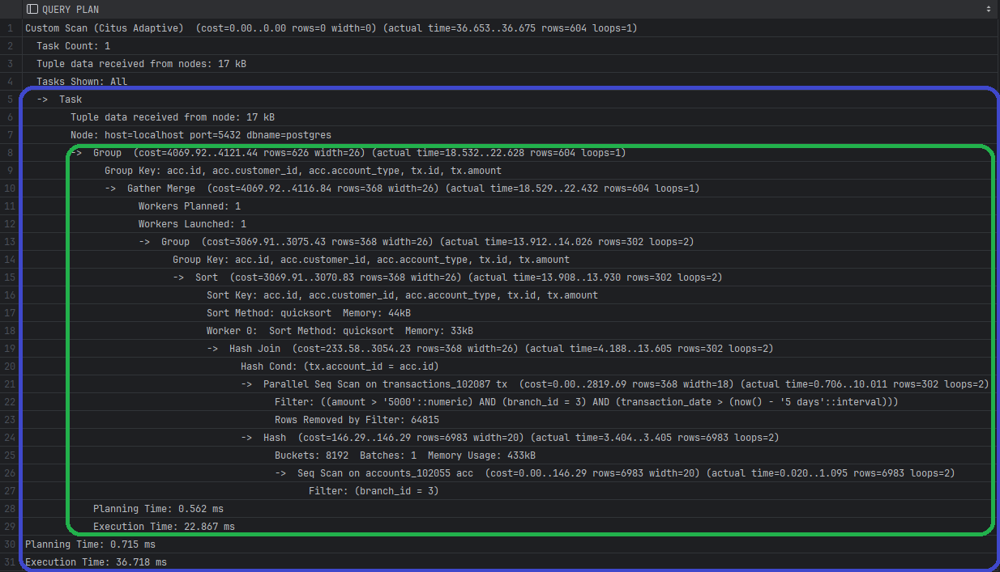

# Exercise 3: single-node PostgreSQL vs single-node Citus with table sharding

## Prerequisites:
- [Exercise 2](..%2F02-single-node-citus-vs-postgresql%2F02-exercise-walkthrough.md) is completed.
- PostgreSQL (port 5436) and Citus (port 5432) nodes are operational.

---

> [!NOTE]
> All queries in this exercise should be executed on the `coordinator` node.

## Distribute tables on the single Citus node:

1. Shard tables:
   Let's shard some tables using Citus' `create_distributed_table` function.
   Before creating let's set shard number to 10 (by default a table is split into 32 shards):
   ```postgresql
   SET citus.shard_count TO 10;
   ```

   Run the following SQL query on the Citus node:

   ```postgresql
   SELECT create_distributed_table('accounts',     'branch_id');
   ```
   where, the 1st agr is table name and the 2nd - distribution column.

   You should get an error about `branches` table distribution.

   > [!NOTE]
   > Tables that are references by foreign key should be either a
   > distributed (split into shards to send to nodes)
   > or reference table (send as a whole to nodes)

   Run the following SQL queries on the Citus node:
    ```postgresql
    SELECT create_distributed_table('branches',     'id');
    SELECT create_distributed_table('accounts',     'branch_id');
    SELECT create_distributed_table('transactions', 'branch_id');
    ```
   
    The `customer` table remains as a "local table" for now. We will back to it later.

2. Verify sharding finished successfully:
    1. Check the `pg_dist_partition` table - all tables that have been distributed:
       ```postgresql
       SELECT * FROM pg_dist_partition;
        -- OR
       SELECT * FROM citus_tables;
       ```

    2. Check the `citus_shards` table - all available shards:
       ```postgresql
       SELECT * FROM pg_dist_shard;
       ```
       You should see that `accounts` and `transactions` tables are in the list and there are multiple shards for each of them:
       <summary>Example (click to expand)</summary>
       
       <details>   
   
    3. Check the `citus_shards_on_worker` view - all shards available on the current node:
       ```postgresql
       SELECT * FROM citus_shards_on_worker;
       ```

   > [!TIP]
   > Check it out!
   > Check more details on the metadata tables/views above (and other tables) in the official documentation [[1]](#useful-links)

3. Rerun some queries to see if performance has changed for the sharded tables.
   ```sql
    EXPLAIN ANALYZE SELECT tx.id, tx.amount, tx.transaction_date FROM transactions tx
    WHERE tx.branch_id = 3 AND tx.amount > 5000 AND tx.transaction_date > NOW() - INTERVAL '5 days';
    ```
    ```sql
    EXPLAIN ANALYZE SELECT acc.id, acc.customer_id, acc.account_type, tx.id, tx.amount
    FROM accounts acc
             JOIN transactions tx
                  ON tx.branch_id = acc.branch_id
                      AND tx.account_id = acc.id
    WHERE acc.branch_id = 3 AND tx.amount > 5000 AND tx.transaction_date > NOW() - INTERVAL '5 days'
    GROUP BY acc.id, acc.customer_id, acc.account_type, tx.id, tx.amount;
    ```
    ```sql
    EXPLAIN ANALYZE
    SELECT acc.id, acc.customer_id, acc.account_type, tx.id, tx.amount
    FROM accounts acc
             JOIN transactions tx
                  ON tx.branch_id = acc.branch_id
                      AND tx.account_id = acc.id
    WHERE acc.branch_id IN (2,3) AND tx.amount > 5000 AND tx.transaction_date > NOW() - INTERVAL '5 days'
    GROUP BY acc.id, acc.customer_id, acc.account_type, tx.id, tx.amount;
    ```

   Now, you should see "nested" execution plans:
   <details> 
   <summary>Example (click to expand)</summary>
   
   <details> 
   Also, you should notice performance improvement on the Citus node over the PostgreSQL node. It is simply because Citus should process fewer rows in order to process the query.
   Still, in real world scenario, data for each tenant most likely will be located in another server so network latencies will be there.

   > [!TIP]
   > Think about it!
   > What other cases, where may you see a read performance improvement from a sharded table even for a single-node?
   > <details><summary>Answer</summary>Smaller table = smaller Indexes = higher change to be stored in memory</details>


Extra:
   You can directly query data from a specific shard:
   ```postgresql
    SELECT * from transactions_102104;
   ```
   where `transactions_102104` is a shard with `ID=102104` for the `transactions` table.

   > [!NOTE]
   > Shard IDs are generated in runtime, so you may have different values.

---

## Key Takeaways
- Sharding may boost read performance even for a single Citus node;
- It is still possible to have regular (non-distributed) tables when using Citus;
- Citus has enhanced execution plan analysis for distributed environment;
- Citus has as set of metadata tables/view for monitoring and observing cluster's nodes and shards metadata, locations.

## Useful Links:
1. Citus Coordinator metadata (tables): https://docs.citusdata.com/en/stable/develop/api_metadata.html
